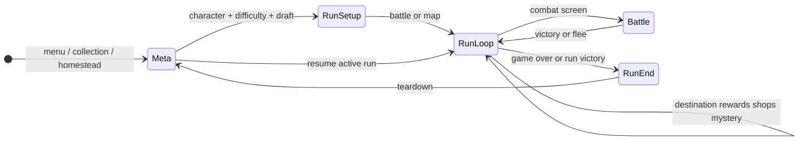
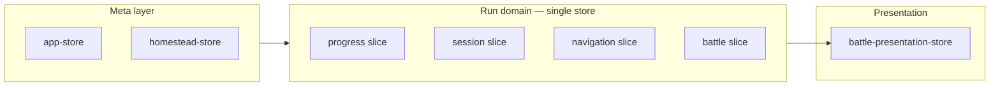

# Run state architecture

A single **run** is owned by **`useRunDomainStore`** (`run-domain-store.ts`) with four internal slices: `progress`, `session`, `navigation`, and `battle`. Use the APIs below instead of ad-hoc store wiring when saving or resuming.

## State ownership

| Concern | Owner | Notes |
|---------|--------|--------|
| Deck, gold, HP, acts, trinkets, talents | `runDomain.progress` | Persisted with meta save |
| Rewards, shops, labyrinth map, mystery | `runDomain.session` | Transient per run |
| Current `Screen` | `runDomain.navigation` | Set via `useActiveRunScreen()` / `setScreen` |
| Combat snapshot + display overrides | `runDomain.battle` | Synced during battle |
| Battle VFX (ghosts, shake, combat text) | `battle-presentation-store` | Not persisted |
| Lifecycle transitions | `run-transitions.ts` | Atomic restore, snapshot, teardown, battle sync |

Use **`run-session-facade`**, **`run-session-actions`**, and **`readActiveRunStore()` / `readRunSessionStore()` / `readBattleStore()`** in feature code.

## Lifecycle (simplified)

## Run phase (`meta` | `runLoop` | `battle` | `runEnd`)

Derived from the current **screen** and **`hasActiveBattle`** via `getRunPhase(screen, hasActiveBattle)` in `@/lib/routing`.

- Exposed on the run controller as `runPhase` and on the VR stage as `data-run-phase` (e2e: `GameStage` in `tests/pages/game-stage.ts`).
- Steam rich presence uses `getSteamRichPresenceLabel(screen, phase, characterId)`.

## Persistence API (canonical)

| API | Role |
|-----|------|
| `createActiveRunSnapshot(source)` | Serialize explicit fields → `ActiveRunData` (lib) |
| `snapshotRunFromDomain(screen?)` / `buildActiveRunSnapshotFromStores` | Read domain store → `ActiveRunData` |
| `restoreRunFromSnapshot(…)` / `restoreActiveRunToStores(…)` | Apply snapshot to domain store on boot/resume |
| `getRunPhase(screen, hasActiveBattle)` | `meta` \| `runLoop` \| `battle` \| `runEnd` |
| `parseActiveRun(raw)` | Validate unknown JSON before hydrate |

## Session read / write facades

| Layer | Module | Use when |
|-------|--------|----------|
| Full read model | `getRunSession(screen)` / `useRunSession(screen)` | Need run + session + battle + phase together |
| Narrow reads | `useRunSessionNavigationSlice`, `useRunSessionBattleContext`, slice hooks + `useRunScreenData` | Subscribe only to fields a hook/screen needs |
| Imperative reads | `readActiveRunStore()` / `readRunSessionStore()` | One-off reads in handlers |
| Writes | `run-session-actions.ts` | Session fields |
| Navigation writes | `useActiveRunScreen()` | Screen routing only |
| Lifecycle | `run-transitions.ts` | `teardownRun`, `syncRunToBattleStart`, `syncBattleToRun`, `restoreRunFromSnapshot` |

**Feature usage:**

- Read model: [`run-session-model.ts`](../../features/alchemy/shared/stores/run-session-model.ts) (reads `useRunDomainStore` slices).
- Screen routes: `useRunScreenData(screen)` → [`run-screen-data.ts`](../../features/alchemy/shared/stores/run-screen-data.ts).
- Restore: [`use-alchemy-run-controller.ts`](../../features/alchemy/shell/use-alchemy-run-controller.ts) calls `restoreActiveRunToStores` on mount.
- Battle presentation: [`battle-controller-context.tsx`](../../features/alchemy/shell/battle-controller-context.tsx) supplies battle screen bindings to routes.

## When changing resume data

1. Extend `ActiveRunData` + Zod in `src/lib/validation/save-schemas/active-run.ts`.
2. Update `ActiveRunSnapshotSource` in `snapshot.ts` and `createActiveRunSnapshot`.
3. Update `restoreRunFromSnapshot` in `run-transitions.ts` if new session fields need restoring.
4. Update `useActiveRunSnapshot` inputs and controller hydration.
5. Run storage/migration tests (see AGENTS.md).

## Store access rules

Production code outside `features/alchemy/shared/stores/` must **not** import:

- `useRunDomainStore` / `run-domain-store.ts` (except via approved adapters in `run-store.ts`)

Use **`run-session-facade`**, **`run-session-actions`**, **`readActiveRunStore()` / `readRunSessionStore()` / `readBattleStore()`**, and **`run-transitions`** instead. Unit tests import slice helpers from `tests/helpers/run-domain-store-test.ts`.

**Tests:** `tests/lib/active-run-session/hydrate.test.ts`, `tests/features/stores/run-session-facade.test.ts`, `tests/architecture/active-run-bootstrap.test.ts`; save resume flows in `tests/save-persistence.spec.ts`.

## Store layout (consolidated)

`syncRunToBattleStart` / `syncBattleToRun` / `teardownRun` / `flushSaveAfterRunEnd` live in [`run-transitions.ts`](../../features/alchemy/shared/stores/run-transitions.ts) (re-exported from `run-session-facade`).

See `eslint.config.js` for enforced import boundaries.
