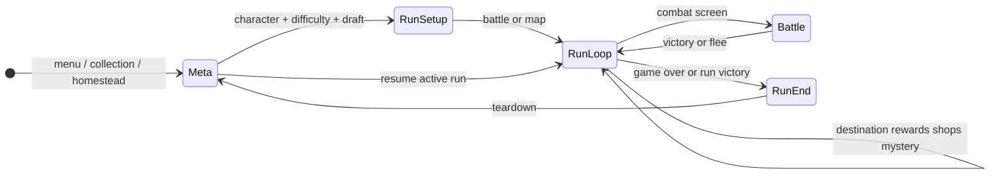
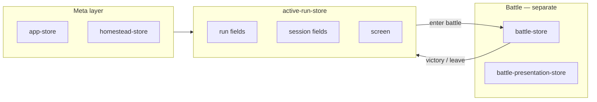

# Run state architecture

A single **run** spans several stores plus React screen state. Use the APIs below instead of ad-hoc store wiring when saving or resuming.

## State ownership

| Concern | Owner | Notes |
|---------|--------|--------|
| Deck, gold, HP, acts, trinkets | `active-run-store` (run slice) | Persisted with meta save |
| Rewards, shops, labyrinth map, mystery | `active-run-store` (session slice) | Transient per run |
| Current `Screen` | `active-run-store.screen` | Set via `useActiveRunScreen()` / `setScreen` action |
| Combat snapshot | `battle-store` | Synced during battle |
| Battle animations / display merge | `battle-presentation-store` | Not persisted |
| Cross-store sync | `run-session-facade` | Battle start/end, teardown only |

`useRunStore` and `useRunSessionStore` are aliases of `useActiveRunStore`. `screen-store.ts` resets transient session fields via `clearTransientSession()`.

## Lifecycle (simplified)

## Run phase (`meta` | `runLoop` | `battle` | `runEnd`)

Derived from the current **screen** and **`hasActiveBattle`** via `getRunPhase(screen, hasActiveBattle)` in `@/lib/routing`.

- Exposed on the run controller as `runPhase` and on the VR stage as `data-run-phase` (e2e: `GameStage` in `tests/pages/game-stage.ts`).
- Steam rich presence uses `getSteamRichPresenceLabel(screen, phase, characterId)`.

## Persistence API (canonical)

| API | Alias | Role |
|-----|-------|------|
| `createActiveRunSnapshot(source)` | `buildActiveRunSnapshot` | Serialize explicit fields → `ActiveRunData` |
| `buildActiveRunSnapshotFromStores(screen)` | — | Read Zustand stores → `ActiveRunData` (features facade) |
| `hydrateActiveRunSession(activeRun, …, targets)` | `restoreActiveRun` | Apply snapshot to stores on boot/resume |
| `restoreActiveRunToStores(…)` | — | `restoreActiveRun` with default store targets (features facade) |
| `getRunPhase(screen, hasActiveBattle)` | — | `meta` \| `runLoop` \| `battle` \| `runEnd` (`@/lib/routing`) |
| `parseActiveRun(raw)` | — | Validate unknown JSON before hydrate |

## Session read / write facades

| Layer | Module | Use when |
|-------|--------|----------|
| Full read model | `getRunSession(screen)` / `useRunSession(screen)` | Need run + session + battle + phase together |
| Narrow reads | `useRunSessionNavigationSlice`, `useRunSessionBattleContext`, `useRunSessionShopSlice`, `useRunSessionMysterySlice`, `useRunSessionLabyrinthSlice`, slice hooks + `useRunScreenData` | Subscribe only to fields a hook/screen needs |
| Imperative reads | `readActiveRunStore()` / `readRunSessionStore()` | One-off `getState()` in handlers |
| Writes | `run-session-actions.ts` | Session fields + `setScreen` on `active-run-store` |
| Low-level | `getActiveRunStore()` | Only inside `run-session-actions` / `store-access` |

**Feature usage:**

- Read model: [`run-session-model.ts`](../../features/alchemy/shared/stores/run-session-model.ts).
- Screen routes: `useRunScreenData(screen)` → [`run-screen-data.ts`](../../features/alchemy/shared/stores/run-screen-data.ts).
- Autosave: `useActiveRunSnapshot()` (screen from store; three slice hooks).
- Restore: [`use-alchemy-run-controller.ts`](../../features/alchemy/use-alchemy-run-controller.ts) calls `restoreActiveRunToStores` on mount.
- Legacy name: `createActiveRunData` in [`active-run-data.ts`](../../features/alchemy/run/active-run-data.ts) re-exports `buildActiveRunSnapshot`.

## When changing resume data

1. Extend `ActiveRunData` + Zod in `src/lib/validation/save-schemas/active-run.ts`.
2. Update `ActiveRunSnapshotSource` in `snapshot.ts` and `createActiveRunSnapshot`.
3. Update `hydrateActiveRunSession` if new session fields need restoring.
4. Update `useActiveRunSnapshot` inputs and controller hydration (`currentScreen`, etc.).
5. Run storage/migration tests (see AGENTS.md).

## Store access rules (Phase 0)

Production code outside `features/alchemy/shared/stores/` must **not** import:

- `useActiveRunStore` / `active-run-store.ts`
- `useRunSessionStore` / `run-session-store.ts` (alias)
- `getActiveRunStore` / `store-access.ts` (except `readActiveRunStore()` from `run-session-read.ts`)

Use **`run-session-actions`** for writes, **`readActiveRunStore()`** for imperative reads, and **facade hooks** (`useActiveRunScreen`, slice hooks) for React subscriptions. Unit tests may import store hooks directly.

## Feature folder layout (Phase 3)

| Zone | Path | Contents |
|------|------|----------|
| Shared | `features/alchemy/shared/` | `ui/`, `config/`, `stores/`, `storage/`, `utils/`, `types.ts` |
| Meta | `features/alchemy/meta/` | Menu, collection, homestead, talents screens + `homestead-context.tsx` |
| Run setup | `features/alchemy/run-setup/` | Character/difficulty/draft/wildwood screens; `run/run-start`, `run-state-init` |
| Run loop | `features/alchemy/run-loop/` | Battle, navigation, shop; in-run screens; destination/victory handlers |
| Shell | `features/alchemy/shell/` | Run/battle/shop/labyrinth controllers |

Legacy import paths (`@/features/alchemy/stores/*`, `@/features/alchemy/run/*`, etc.) resolve via root shims and Vite aliases.

## Screen navigation owner

| Owner | Notes |
|-------|--------|
| `active-run-store.screen` | Single source of truth; hydrate from `ActiveRunData.currentScreen` on bootstrap |
| `useActiveRunScreen()` | Controller subscribes via `run-session-facade` |
| `navigateTo` | Stays in `use-alchemy-run-controller` (timer + transition commit refs) |

`getRunSession()` and `getRunPhase()` default to `active-run-store.screen` when no screen argument is passed.

## Store layout (Phase 4 — implemented)

`syncRunToBattleStart` / `syncBattleToRun` remain the only run↔battle field sync in `run-session-facade`.

See `eslint.config.js` for enforced import boundaries (lib ↔ features, screens ↔ orchestration, session store access).
